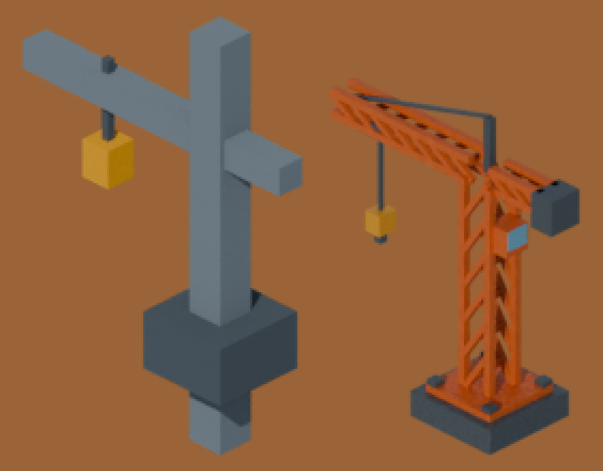

# BR Port — Subir a arte no Blender: veredito e prompts

> Escrito em 29/08/2026, a partir da pergunta "dá para chegar naquele nível de
> imagem usando o Blender?" sobre uma referência de porto ilustrado.
>
> Não substitui `BLOCO4_PROMPTS_ISOMETRICO.md` — aquele é para gerador de
> IMAGEM, e continua valendo para retratos (Arlindo, Sr. Ribeiro), que não se
> escrevem em coordenadas. Este é para o que se escreve: props em Blender.

---

## 1. O veredito, em uma linha

**Metade sim, e é a metade que importa.** O Blender por script alcança o
*volume*, a *luz*, o *desgaste* e a *densidade de peça* da referência. Não
alcança a *pincelada* — a textura pintada à mão da vegetação, da areia e da
espuma. Mas essa metade que falta é a que menos pesa numa tela de 720×1280,
e a que mais custa manter coerente entre vinte props.

### A medição, não a opinião

`tools/demo_guindaste_rico.py` renderiza o MESMO guindaste nos dois pipelines,
na MESMA câmera, na escala de produção. À esquerda o que o jogo tem hoje; à
direita o que dá para ter sem trocar de ferramenta:



| | hoje | subido |
|---|---|---|
| peças | 5 | 75 |
| sprite na tela | 133×207 px | 119×178 px |
| pixels opacos | 10.904 | 8.379 |
| render | 5 s | 27 s |

**O detalhe não custa espaço de tela.** O guindaste rico é *menor* que o atual
e tem 15 vezes mais peças.

O custo previsto era tempo de render — e a previsão saiu errada, para melhor.
Estimei ~9 min para os 20 props a partir dos 27 s do demo; **o lote inteiro
leva 54 s**. O demo usava 128 amostras sem denoiser; ligar o denoiser deixa
64 amostras saírem limpas e mais baratas que 128 sem ele. Fica o registro
porque a conta errada quase fez o custo parecer proibitivo.

O que fez a diferença, em ordem de impacto:

1. **Vazado.** Guindaste de verdade é treliça, e treliça deixa o fundo aparecer
   no meio da estrutura. Uma caixa maciça nunca lê como guindaste, por melhor
   que esteja a luz. Foi a única mudança que exigiu geometria nova.
2. **Chanfro em tudo.** Aresta viva não pega luz; aresta chanfrada pega uma
   linha de luz e o volume aparece sozinho. É um modificador, três linhas.
3. **Luz de três pontos.** O sol único de hoje dá três tons por volume e para
   aí. O preenchimento frio tira a sombra do preto morto e o contraluz põe um
   fio de luz na quina de cima — é esse fio que separa a peça do fundo.
4. **Desgaste procedural.** Um ruído ligado à cor base faz duas caixas da mesma
   cor pararem de ler como a mesma caixa.

---

## 2. A armadilha da referência

A imagem de referência **não é uma tela de jogo, é arte promocional**. Copiá-la
ao pé da letra quebra o jogo, por três motivos concretos:

1. **A perspectiva dela é pintada, não projetada.** Os guindastes, os prédios e
   a água não concordam entre si sobre onde fica o horizonte. O nosso píer é o
   MESMO prop em três posições — se a projeção não for uma conta só, a peça
   que serve na Doca 1 fica torta na Doca 3.
2. **Nada ali se repete.** Cada barco, cada pedra e cada onda é única. O nosso
   orçamento é um prop reutilizado, e é isso que mantém o jogo com 20 arquivos
   em vez de 200.
3. **Os rótulos estão assados na arte.** "DOCA 1" ali é pintura; aqui é UI que
   muda de estado.

O que **dá** para roubar dela sem quebrar nada: a densidade de peça (treliça,
cabo, guarda-corpo, escada), a paleta quente contra o azul da água, o contorno
escuro nas silhuetas, e a ideia de que o pátio é habitado — caminhão, gente,
carga espalhada.

---

## 2.5. O que já foi EXECUTADO (29/08/2026)

Os prompts A, B, C e D foram rodados nesta mesma sessão, com o Blender já
instalado. Estado:

| Prompt | Estado | O que ficou |
|---|---|---|
| **A** — luz, chanfro, desgaste | **feito** | rig de três pontos, `BEVEL` em toda malha, `material_gasto()` com ruído procedural |
| **B** — sombra de contato | **feito** | passe separado, composto em numpy dentro do próprio Blender |
| **C** — geometria | **feito no guindaste** | torre e lança de treliça vazada, cabine, contrapeso, tirantes; prédios e barcos por fazer |
| **D** — contorno | **testado e REJEITADO** | flag `--contorno` fica, desligada; ver abaixo |
| **E** — água em Blender | não iniciado | continua sendo decisão do Bruno |

### As cinco correções que só apareceram ao executar

1. **Escala de ruído é relativa ao tamanho da peça.** Usei 14–24 para tudo na
   primeira passagem. Numa longarina de 0,045 isso dá uma marca; numa parede de
   galpão de 3 unidades dá setenta, e a parede vira LIXA. A tabela `DESGASTE`
   ficou dividida em três faixas por isso, e a regra é olhar o prop, não a
   tabela.
2. **Preenchimento a 260 lava a forma.** Com ele forte demais as três faces do
   volume voltam ao mesmo tom, que é exatamente o que a chave existe para
   evitar. Ficou em 150: serve para tirar o preto da sombra, não para iluminar.
3. **Sombra no azimute do mapa fica INVISÍVEL.** A convenção de faces do SVG
   (face +mx mais escura que a +my) implica luz de baixo-esquerda na tela, e a
   sombra correspondente cai atrás do prop, onde o próprio prop a esconde. Os
   coqueiros ficaram bons e o armazém e os contentores não ganharam sombra
   nenhuma que se visse. O passe de sombra passou a ter azimute próprio (250°),
   assumindo a inconsistência: a sombra não está ali para dizer de onde vem o
   sol, está para dizer que a peça toca o chão.
4. **`use_freestyle` já cria um lineset, e cria-o sem estilo.** Criar outro por
   cima não resolve — o Freestyle percorre todos e rebenta com `'NoneType'
   object has no attribute 'use_chaining'`. Reaproveitar o que existe, e
   garantir estilo em cada um.
5. **Freestyle contorna o plano apanhador de sombra.** Um losango escuro de 16
   unidades entrava na composição. O passe de sombra desliga o Freestyle.

### Por que o contorno foi rejeitado

Depois de corrigidos os dois bugs acima, o contorno ficou tecnicamente correto
e mesmo assim não compensou, na escala em que estes props aparecem:

- no galpão quase não se vê — não paga o tempo de render;
- no guindaste **piora**: cada longarina da treliça ganha um halo cinzento e o
  vazado, que era o ponto inteiro da peça, fecha;
- no trabalhador (menos de 60 px) o traço é proporcionalmente enorme e a peça
  fica embaçada.

A flag `--contorno` fica no gerador, desligada por padrão, para que a próxima
conversa não volte a tentar às cegas. Reabri-la só faz sentido com espessura
escalada pelo tamanho do prop, e provavelmente só nos props grandes.

---

## 3. Os prompts

Cada um é para colar numa conversa nova do Claude Code. Estão em ordem de
retorno: o primeiro mexe em todos os props sem tocar em geometria nenhuma, e é
onde está a maior parte do ganho.

**A, B e D já foram executados** (ver §2.5) — valem como registro do que foi
pedido e como base para reabrir. O que continua por fazer é a segunda metade
do **C** (prédios, barcos, píer) e o **E**.

### Preâmbulo (colar antes de qualquer um dos prompts)

```
Continuando o BR Port. Leia docs/BLOCO5_BRIEFING_CONTINUACAO.md,
docs/BLOCO5_PROMPTS_BLENDER_RICO.md e depois docs/ESTADO_DO_PROJETO.md.

Restrições que NÃO se negociam neste trabalho:

- A câmera não muda. ROT_X=60, ROT_Z=45 e ESCALA_ORTO em
  tools/gerar_props_iso.py são a mesma projeção de tools/gerar_mapa_iso.py.
  Mexer num sem mexer no outro desalinha todos os props do chão.
- pos(mx, my, altura_px) é a única ponte entre mapa e Blender, e o sinal de Y
  é invertido de propósito. Não recalcular na mão em lugar nenhum.
- Altura vem de z(altura_px). O mapa trata altura como pixel livre; o Blender
  projeta de verdade. Só o z() sabe converter.
- film_transparent fica ligado e NÃO entra apanhador de sombra no passe do
  prop (ver a armadilha 2 na §4).
- Peças que animam separadas (copa do coqueiro, lança do guindaste) saem de
  renders diferentes da MESMA câmera, senão perdem registro.
- O gerador confere a própria projeção no fim (tabuado ~207 px). Se essa
  conferência falhar, pare: o resto não presta.

O Blender entra como biblioteca, sem interface, e o contêiner é efêmero:
  python3 -m venv ~/bpy-venv && ~/bpy-venv/bin/pip install "bpy==4.5.13"

Teste verde não prova que ficou bonito: toda mudança visual termina em
brport_vs/tools/capturar_tela.gd (aceita `completo` como 3º argumento para
fotografar o porto reconstruído) e em olhar o PNG.
```

---

### Prompt A — Luz, chanfro e desgaste (começar por aqui)

```
Suba a qualidade de render de TODOS os props em tools/gerar_props_iso.py sem
mexer na geometria de nenhum deles. Três coisas:

1. Troque o sol único por um rig de três pontos: chave quente com sombra de
   beirada macia (sun angle ~1,5°, não mais — acima disso a sombra borra),
   preenchimento frio numa área grande vindo do lado oposto, e um contraluz
   por cima e por trás. O contraluz é o que põe um fio de luz na quina de
   cima e separa a peça do fundo sem precisar de contorno desenhado.

2. Ponha um modificador BEVEL em toda malha antes de renderizar: largura
   ~0,022, 2 segmentos, limit_method ANGLE a 40°. Aresta viva não pega luz.

3. Faça uma segunda função de material ao lado de material(): mesma cor, mas
   com Noise -> ColorRamp misturando a cor base com uma versão mais escura
   dela, roughness ~0,6 e um pouco de specular. Aplique nos props de metal,
   madeira e parede. Mantenha a material() chapada para o que precisar
   continuar liso.

Suba cycles.samples o suficiente para o ruído sumir (24 não chega com luz de
área; 128 chegou no meu teste) e meça quanto o render passou a demorar.

Depois: regenere todos os props, reimporte no Godot, capture as duas telas
(inicial e `completo`) e compare com o que havia antes. Se algum prop tiver
piorado, diga qual e por quê em vez de deixar passar.
```

**Por que este primeiro:** é o único que melhora vinte props de uma vez e não
pode quebrar alinhamento — nenhuma coordenada muda.

---

### Prompt B — Sombra de contato como passe próprio

```
Os props do BR Port não projetam sombra nenhuma, e é isso que os faz parecer
adesivo colado no mapa. Acrescente sombra — mas como PASSE SEPARADO, nunca no
mesmo render do prop (a armadilha está medida na §4 de
docs/BLOCO5_PROMPTS_BLENDER_RICO.md).

Para cada prop, além do PNG que já existe, grave um <nome>_sombra.png:
renderizado da MESMA câmera, com um plano apanhador de sombra pequeno na
altura em que o prop se apoia, e com o próprio prop invisível para a câmera
mas ainda projetando (is_shadow_catcher no plano; hide_render não serve
porque tira a sombra junto — use visible_camera=False).

Eleve a chave para ~68° só neste passe. Com os 48° do mapa a sombra sai
comprida e o sprite fica com um rabo escuro atravessado no piso; sombra de
sprite é para grudar a peça no chão, não para contar a hora do dia.

No Godot, desenhe a sombra como um TextureRect abaixo do prop, com
modulate.a por volta de 0,35, ancorado exatamente na mesma origem do prop.
Confira no capturar_tela.gd que a sombra cai do lado certo — o sol do mapa
vem de cima-esquerda, então a sombra vai para baixo-direita.
```

---

### Prompt C — Refazer um prop de cada vez

```
Refaça a geometria do <PROP> em tools/gerar_props_iso.py com a densidade de
peça de um porto de verdade, mantendo a silhueta geral e o tamanho na tela.

A regra que vale para todos: o que dá leitura não é textura, é VAZADO e
REPETIÇÃO. Guindaste é treliça; guarda-corpo é uma fila de balaústres;
escada é uma fila de degraus; galpão tem costela de telhado. São laços de
caixas pequenas, não malha nova.

Faça um helper para cada padrão que repetir (já existe um exemplo de treliça
em tools/demo_guindaste_rico.py) em vez de escrever peça por peça.

Ordem sugerida, do que mais aparece para o que menos aparece:
  1. guindaste (é a peça que diz "isto é um porto")
  2. armazém e escritório (ocupam o pátio inteiro)
  3. cargueiro e barco de pesca
  4. píer (corrimão, cabeços, escada de acesso)

Faça UM por vez e capture a tela entre cada um. Se a peça nova não ler melhor
que a antiga na escala do jogo, ela não vale o tempo de render — diga isso em
vez de commitar.
```

---

### Prompt D — Contorno (o que mais aproxima do "ilustrado")

```
Acrescente contorno escuro nas silhuetas dos props do BR Port. É o que mais
aproxima o render 3D da arte ilustrada de referência.

Tente as duas saídas e escolha pela imagem, não pela teoria:

1. Freestyle (scene.render.use_freestyle) com espessura ~1,5 px, cor bem
   escura da própria peça em vez de preto puro, e só nas bordas de silhueta —
   contorno em toda aresta interna vira desenho técnico.

2. Casca invertida: um SOLIDIFY com offset para fora, normais invertidas e
   material de emissão escura, renderizado atrás do prop.

Meça o custo de render das duas. Se o contorno engrossar demais nos props
pequenos (o trabalhador tem menos de 60 px), escale a espessura pelo tamanho
do prop em vez de usar um valor fixo.
```

---

### Prompt E — Água e terreno em Blender (o salto grande, e o mais arriscado)

```
Hoje a água e o terreno do BR Port são SVG gerado por tools/gerar_mapa_iso.py.
Avalie — e só depois faça — mover a ÁGUA para um render de Blender.

Antes de escrever qualquer coisa, responda com medição:
- Quantos px o mapa tem de água visível na tela?
- Um render de Blender do mesmo tamanho pesa mais que o SVG importado?
- A água precisa ser um tile que repete ou uma peça só de 720×720?

O que o Blender ganharia: refração, espuma que reage à geometria da margem, e
ondas com volume em vez de risquinhos. O que ele perderia: o SVG hoje é
regenerado em 200 ms e versionado como texto legível no git — um PNG não é
nem uma coisa nem outra.

Se a conta não fechar, DIGA QUE NÃO FECHOU e pare. Trocar um gerador que
funciona por um mais bonito e mais lento é uma decisão do Bruno, não sua.
```

---

## 4. Armadilhas já medidas (não repetir)

1. **`cycles.samples = 24` chega para sol duro e não chega para luz de área.**
   O rig de três pontos ficou granulado a 24; a 128 ficou limpo. O custo foi
   5 s → 27 s por prop.

2. **Apanhador de sombra com `film_transparent` escreve alpha no plano
   INTEIRO, não só onde há sombra.** Medido: 108.590 px com alpha > 0 para
   14.552 px de guindaste. Encolher o plano de 40 para 6 unidades ainda deixou
   38.533. No jogo isso é um retângulo cinzento em volta da peça. Por isso a
   sombra é passe separado (Prompt B) — não é preferência de organização, é a
   única saída.

3. **Sol a 48° dá sombra comprida demais para sprite.** É o ângulo certo para
   o mapa e o errado para a peça: o sprite fica com um rabo escuro atravessado.
   No passe de sombra, subir para ~68°.

4. **Cabine branca no meio de uma estrutura laranja lê como bloco solto.**
   Peça de cor muito diferente da estrutura precisa ser pequena e encostada,
   ou pintada na cor da estrutura com só o vidro contrastando.

5. **A conferência de projeção no fim do gerador é o que separa "mudei a luz"
   de "quebrei tudo".** Ela mede o tabuado renderizado contra a conta do mapa
   (esperado 207 px). Qualquer prompt daqui que a faça falhar está errado,
   por mais bonito que tenha ficado o render.

---

## 5. O que fica de fora, honestamente

O Blender por script **não** vai entregar:

- **Pincelada.** Folhagem pintada, areia com grão, espuma desenhada à mão.
  Dá para aproximar com textura procedural, mas não é a mesma coisa e é onde
  o esforço rende menos.
- **Retrato de personagem.** Arlindo e o Sr. Ribeiro continuam sendo trabalho
  de gerador de imagem — e lá a perspectiva não importa, porque eles vivem em
  painel e não no chão isométrico.
- **A referência inteira de uma vez.** Aquela imagem tem umas 60 peças únicas.
  O caminho é a escada da §3, um degrau por conversa, com captura de tela
  entre cada um.

---

*BR Port · Prompts de arte em Blender · Fase 4*
